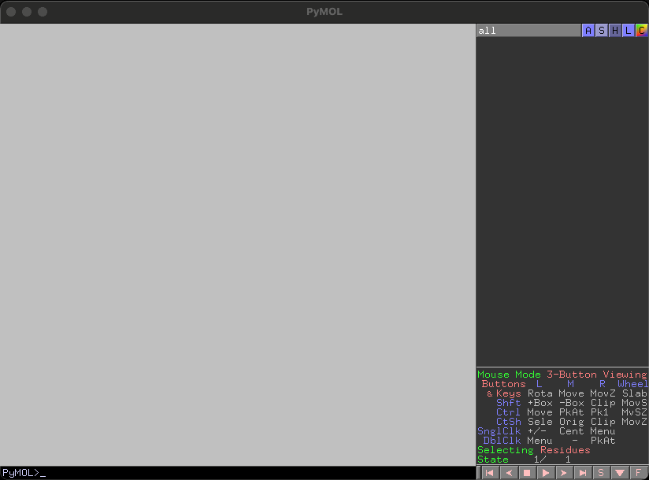

# PyMOL Plugin
This plugin is based on PyMOL, which has been developed as OSS, with respect and thanks to the PyMOL wiki and the voluntary contributors who have made it freely available.  
The basic development environment is Mac M1 or later, but these Plusins have confirmed that it also works on windows.
## PyMOL install
For easy install of PyMOL, I recommend to use `conda`.  
If you already installed Anaconda or miniconda, just install with command in terminal as follow,
```
conda create -n your-env -y -c conda-forge python=3.9 pymol-open-source rdkit
```

## PyMOL instructions
For basic information, I will recommend the link below,
1. University of Osaka
2. PyMOL book
    https://yoshitakamo.github.io/pymol-book/  
    The owere of this tutorial, Dr. Yoshitaka Moriwaki, is one of great contributor of PyMOL. His support helped me enormously with my start of PyMOL. I appreciate his support and contribution to OSS community.
3. PyMOL wiki
    https://pymolwiki.org/index.php/Main_Page

## PyMOL Plugin
This Plugins were described by Python, used pymol and rdkit.
### residues.py

Visualisation is a very important element in OSS-SBDD, and while PyMOL has a rich implementation of commands for visualisation, this plugin aims to make it easier. Let's get started.

When developing kinase inhibitors, it is necessary to find gatekeepers located deep in the ATP pocket, e.g. threonine, methionine and lysine.  
Or, it will be necessary to identify from the structural information whether the lysine is in the right position on the surface of your target for which you want to explore a degrader.  
After fetching the PDF file `1ATP`, type `see` to focus the surroundings of ligand within 8A distance.


One-letter command for visualization of respective amino acid residues helps you to find the all residues you want to know.  
Type One-letter residue and press Enter, then the sticks of residues you want to know will be showed for enabled objects.


Annoying water molecules? Type `del`. You would like to show them again? Type `sol`. Don't you need the hydrophobic hydrogens? Type `ph`. You can focus more into proteins or nucleic acid oligomers.


Lots of PDB files includes the structural information of not only monomer, but also multiple complexes. Type `cc` to identify the respective chain information by coloring.  
I like sipmple color cordinates. `white` command will make the color of cartoon and carbon chains white.  
If you would like to change the cartoon color by secondary structural information, type `dssp` to change the color of helixes into red, sheets into yellow and loops into gray, respectively.  
AF2 predicted structure? Type `plddt` to turned cartoon's color by plddt scores.  


Some PDB files includes the ligand infomation, which bounds to the receptor molecule to interact and get some functions.  
This grateful and useful information will help you to design or modify the molecules. Let's find the intaraction information with this plugin.
`byres` command will make objects of ligand and residues within 4A distance, then navigate you there. Type `tag` to show the residue's name selected. Polar contact object is also created by `byres` command.
Not organid ligand? Well, you may see the peptide or nucleic acid ligand. Typing `at` after selecting the ligand to help you find the polar contacts you would like to see.  
Would you like to see the surface around the ligand? Type `well` to show the surface of around the ligand within 5A distance.


### text2structure.py




## PyMOL Plugins from other sources
My favarite Plugins were described below. Great thanks to all of contributors for PyMOL

### how to install Plugins
1. install as addin from PyMOL  


2. load Plugins from source

3. load Plugins from local file


### Color By Mutations
https://pymolwiki.org/index.php/Color_By_Mutations


### centroid


### findseq


### ESMfold for PyMOL


### Drawingbox


### gridbox
